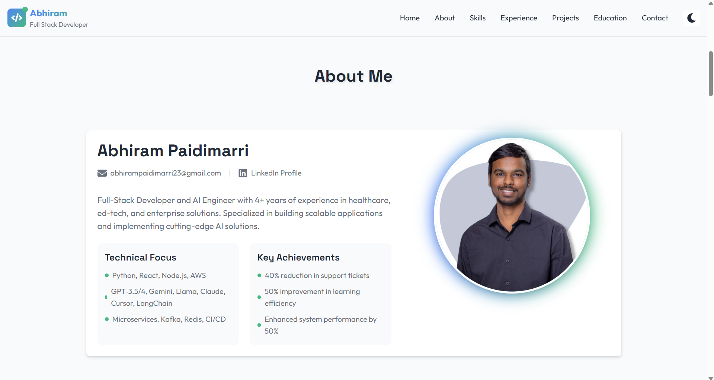

# Personal Portfolio Website

A modern, responsive portfolio website built with React and Tailwind CSS, showcasing my skills, projects, and professional experience.

[](https://app.netlify.com/sites/abhirampaidimarri/deploys)
[](https://abhirampaidimarri.netlify.app/)



## 🌟 Features

- **Responsive Design**: Seamlessly adapts to all devices and screen sizes
- **Dark Mode**: Toggle between light and dark themes
- **Smooth Animations**: Engaging scroll animations and transitions
- **Interactive Projects**: Carousel showcase of projects with detailed descriptions
- **Skills Visualization**: Visual representation of technical skills and expertise
- **Contact Integration**: Easy-to-use contact form for professional inquiries

## 🛠️ Technologies Used

- **Frontend Framework**: React.js
- **Styling**: Tailwind CSS
- **Animations**: Framer Motion
- **Icons**: React Icons
- **Carousel**: React Slick
- **Deployment**: Vercel

## 🚀 Key Sections

1. **Hero Section**: Engaging introduction with call-to-action
2. **About**: Professional background and expertise
3. **Skills**: Technical skills with visual indicators
4. **Projects**: Interactive carousel of completed projects
5. **Experience**: Professional journey and achievements
6. **Education**: Academic background and certifications
7. **Contact**: Easy-to-use contact form

## 🏗️ Project Structure

```
src/
├── components/         # Reusable UI components
├── assets/            # Images and static assets
├── styles/            # Global styles and Tailwind config
├── App.jsx            # Main application component
└── main.jsx          # Application entry point
```

## 🚀 Getting Started

### Prerequisites

- Node.js (v14 or higher)
- npm or yarn

### Installation

1. Clone the repository

```bash
git clone https://github.com/yourusername/portfolio.git
```

2. Install dependencies

```bash
cd portfolio
npm install
```

3. Start the development server

```bash
npm run dev
```

4. Build for production

```bash
npm run build
```

## 🎨 Customization

- **Colors**: Modify the Tailwind configuration in `tailwind.config.js`
- **Content**: Update project data in respective component files
- **Images**: Replace images in the `assets` folder
- **Styling**: Adjust styles in component files

## 📱 Responsive Design

- Mobile-first approach
- Breakpoints for all device sizes
- Optimized images and assets
- Touch-friendly interactions

## 🔧 Performance Optimization

- Lazy loading of images
- Code splitting
- Optimized assets
- Efficient animations

## 📄 License

This project is licensed under the MIT License - see the [LICENSE](LICENSE) file for details.

## 🤝 Contact

Feel free to reach out for any questions or collaborations!

- Email: your.email@example.com
- LinkedIn: [Your LinkedIn Profile]
- GitHub: [Your GitHub Profile]

---

Made with ❤️ by [Your Name]

## 🌐 Live Demo

Visit my portfolio at: [https://abhirampaidimarri.netlify.app/](https://abhirampaidimarri.netlify.app/)
